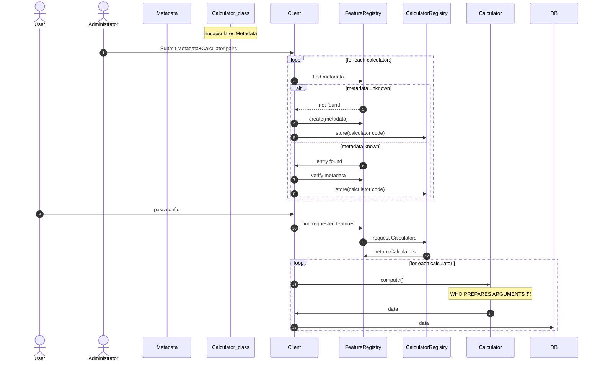

```mermaid
sequenceDiagram
    autonumber

    actor User
    actor Administrator
    participant Metadata
    participant Calculator_class
    participant Client
    participant FeatureRegistry
    participant CalculatorRegistry
    participant Calculator
    participant DB

    Note over Calculator_class: encapsulates Metadata
    Administrator->>Client: Submit Metadata+Calculator pairs

    loop for each calculator:
        Client->>FeatureRegistry: find metadata

        alt metadata unknown
            FeatureRegistry-->>Client: not found
            Client->>FeatureRegistry: create(metadata)
            Client->>CalculatorRegistry: store(calculator code)
        else metadata known
            FeatureRegistry->>Client: entry found
            Client->>FeatureRegistry: verify metadata
            Client->>CalculatorRegistry: store(calculator code)
        end
    end

    User->>Client: pass config
    Client->>FeatureRegistry: find requested features
    FeatureRegistry->>CalculatorRegistry: request Calculators
    CalculatorRegistry->>FeatureRegistry: return Calculators

    loop for each calculator:
        Client->>Calculator: compute()
        Note over Calculator:  WHO PREPARES ARGUMENTS ❓❗
        Calculator->>Client: data
        Client->>DB: data

    end


```
